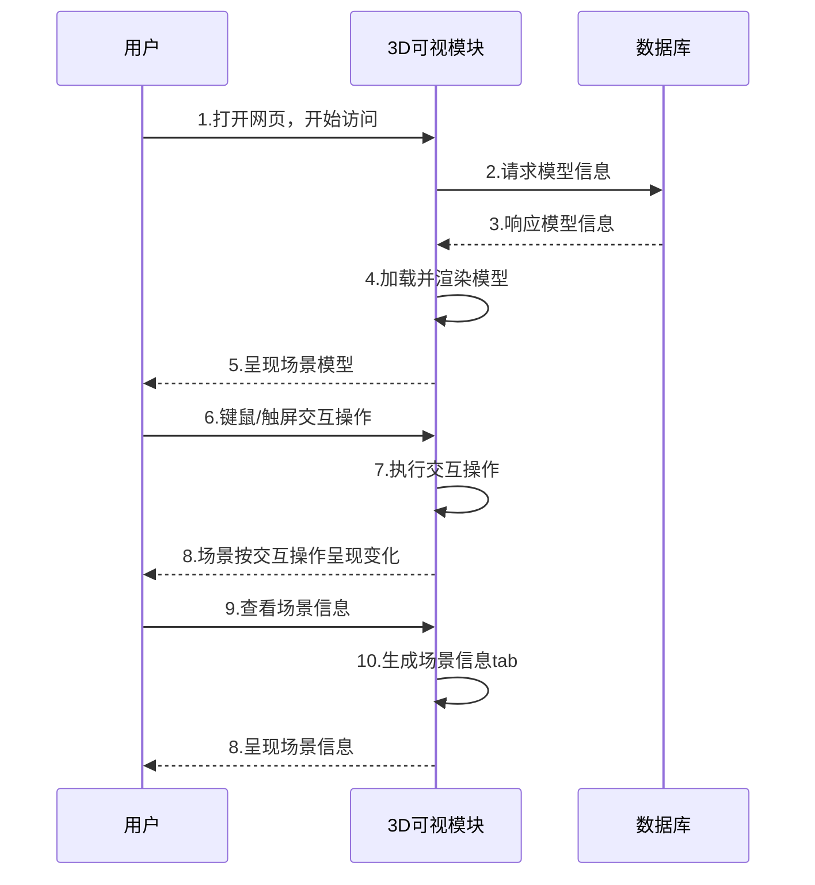
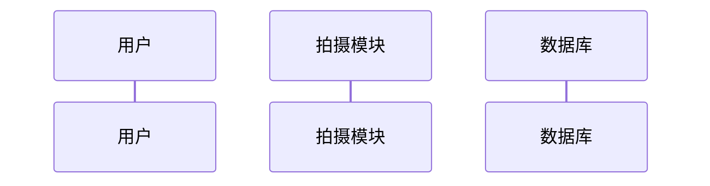
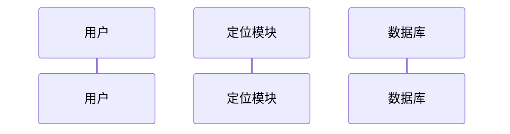
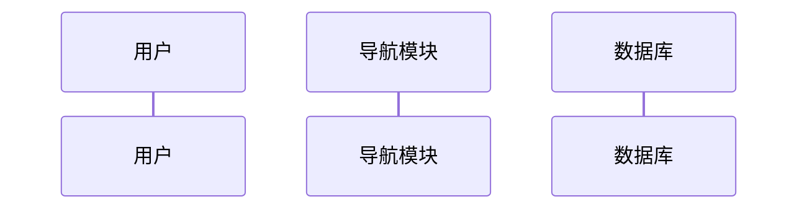

# 目标和关键技术分析
1> 目标：让用户只需要用手机相机对周围环境进行拍摄操作，就能够实现室内定位。
2> 关键技术分析：
    1.计算机视觉图像分析
    1)通过手机相机获取图像，使用图像分析算法对图像进行分析(图像文字识别、场景识别)。
    2)图像文字识别：获取图片价值高的文字，在定位API的POI搜索栏中搜索来实现定位。
    3)场景识别：使用场景识别API对图片中的场景进行分析、筛选
    2.室内定位
    1)室内图显示：此处可以和WebGL相结合。
        2)定位实现：此处可以与传统WiFi指纹识别技术相结合。
    3.室内导航
    1)导航路线：此处可以和AR相结合。

# 实现思路
1. 当系统获取用户拍摄的图片后，对图片进行分析(考虑使用阿里云API，目前来看准确度不高，需要定制优化。)
2.从步骤1中分析出有用的信息，在这些信息的基础上做出定位判断。此处可以考虑调用高德地图的室内图API(demo截图如下图)。此处可以将WebGL加入室内图的实现
3.步骤2完成之后基本已经实现室内定位。此时可以输入目的地将AR与导航路线相结合。

- 20190506思路
    + 摄像机

# API
## 高德地图
- [室内地图 JS API](https://lbs.amap.com/api/javascript-api/reference/indoormap)
    + 通用平台：Web、Android、iOS
    + 宣传优势
        * 室内地图渲染
        * 室内POI(兴趣点)搜索(TH：可以利用这一点。计算机视觉识别图像中的文字，将这些文字传到POI搜索框进行定位)
        * 室内路线规划
    + 实现
        * 类: AMap.IndoorMap 室内地图插件
        * Building对象
            - floor：所在楼层
            - name：楼层名称
            - lnglat：楼层经纬度
            - id：所属楼宇信息
        * Shop对象
            - id：店铺id
            - name：店铺名称
            - lnglat：店铺经纬度
            - building_id：店铺所属楼宇信息

- [定位 JS API](https://lbs.amap.com/getting-started/locate)
    + 通用平台：Web、Android、iOS
    + 宣传优势
        * 基于多途径的混合定位方式
            - 定位方式
                + GPS
                + 基站
                + WiFi
                + 蓝牙
                + 传感器
            - 混合定位方式的优点
                + 毫秒级响应
                + 毫安级耗电
                + 十米内精度
                + 无GPS依赖
        * 室内室外定位一体化，室内定位米级突破
        * 日均千亿级定位请求，10部手机中9部使用高德位置服务
        * 地理围栏实现精准推送
            - 高德POI
            - 行政区划分
            - 自定义圆形
            - 多边形
    + 实现
        * 类
            - AMap.Geolocation 定位插件
            - AMap.CitySearch 城市查询，IP定位获取当前城市信息插件
        * GeolocationResult对象
        * CitySearchResult对象
            - city：城市名称
            - bounds：地图展示该城市时的矩形区域

- [室内定位 SDK](https://lbs.amap.com/api/android-indoorlocation-sdk/summary)
    + 通用平台：Android、IOS
    + 宣传优势
        * 高精度室内定位体验
            - 1-8m平均精度
            - 平滑跟随
            - 精准方向指示
        * 精确的垂直维度定位
            - 楼层定位
        * 多种定位方式融合
            - WiFi
            - BLE(Bluetooth Low Energy低能耗蓝牙)
            - PDR(pedestrian dead-reckoning步行者航位推算算法)
            - 地磁
    + 实现方案(需要现场定位硬件设备支持，设备部署方案)
        * WiFi
            - 定位精度：3-8m
            - 部署密度：700平1个
            - 设备单价：上百元
        * 蓝牙
            - 定位精度：1-5m
            - 部署密度：50平1个
            - 设备单价：数十元
    + 数据获取方案
        * 联系高德认证的室内数据采集厂商进行数据采集
        * 如果室内建筑未铺设WIFI或蓝牙IBeacon，则先联系高德认证的室内定位硬件部署厂家
    + 定位数据更新
        * 半年一次


## 百度地图
- [室内图](http://lbsyun.baidu.com/products/products/indoor)
    + 通用平台：Web、Android、iOS
    + 宣传优势
        * 覆盖全国4000家大型建筑
        * 分层浏览
        * POI检索
        * 路线指引
- [定位 JS API](http://lbsyun.baidu.com/index.php?title=jspopular/guide/geolocation)
    + 通用平台：Web、Android、iOS
    + 宣传优势
        * 米级室内定位
        * 定位服务全球化
        * 智能硬件定位
        * 离线定位
        * 位置语义化
        * 地理围栏
        * IP定位(HTTP协议中的定位接口，精度不高)
- [室内定位管理平台](http://lbsyun.baidu.com/indoor/indoormap/introduct)
    + 对企业级开放的API

## 阿里云
- [图像识别API](https://ai.aliyun.com/image)
    + 业务场景
        * 通过模式识别、机器学习技术分析图像，识别其中的场景和物体
    + 服务
        * 图像打标、**场景识别**、鉴黄
    + 场景识别API
- [阿里云官方服务API校验规范](https://help.aliyun.com/document_detail/30245.html)

# 阿里云场景识别测试数据

```
 {
    "tags":[
    {"value":"办公室","confidence":59.0},
    {"value":"室外","confidence":40.0},
    {"value":"其他","confidence":15.0},
    {"value":"演出","confidence":14.0},
    {"value":"会议室","confidence":12.0}],
    "errno":0,
    "request_id":"a6d8ed9d-b317-4421-a4f0-5b66469b8b9d"
 }
```

```
{
    "tags":[
    {"value":"海滨","confidence":96.0},
    {"value":"小河","confidence":13.0},
    {"value":"沙滩","confidence":11.0},
    {"value":"广场","confidence":11.0},
    {"value":"室外","confidence":11.0}],
    "errno":0,
    "request_id":"0469acac-3fcf-4233-ba48-63fddce3ef05"
}
```

```
{
    "tags":
    [{"value":"办公室","confidence":99.0}],
    "errno":0,
    "request_id":"a693c957-51fa-49b3-9105-9eaddefed71d"
}
```

```
{
    "tags":
    [{"value":"物品","confidence":69.0},
    {"value":"其他","confidence":16.0},
    {"value":"演出","confidence":14.0},
    {"value":"室外","confidence":14.0},
    {"value":"卧室","confidence":14.0}],
    "errno":0,
    "request_id":"d289460f-2425-4042-a893-14aeaaa206ce"
}
```

```
{
    "tags":
    [{"value":"办公室","confidence":55.0},
    {"value":"会议室","confidence":20.0},
    {"value":"餐厅","confidence":16.0},
    {"value":"演出","confidence":15.0},
    {"value":"其他","confidence":14.0}],
    "errno":0,
    "request_id":"ce8e1aaf-6c56-4747-8217-87ddbee26942"
}
```

```
{
    "tags":
    [{"value":"物品","confidence":45.0},
    {"value":"办公室","confidence":24.0},
    {"value":"演出","confidence":23.0},
    {"value":"其他","confidence":14.0},
    {"value":"人物","confidence":13.0}],
    "errno":0,
    "request_id":"157dac48-22e6-4098-9c3e-a822865cdc1b"
}
```

```
{
    "tags":
    [{"value":"物品","confidence":66.0},
    {"value":"办公室","confidence":54.0},
    {"value":"室内","confidence":16.0},
    {"value":"餐厅","confidence":12.0},
    {"value":"演出","confidence":11.0}],
    "errno":0,
    "request_id":"1a555523-96de-4c2d-be84-44dfc6aca3bc"
}
```
    每个`value`都有对应的`confidence`，遍历所有列出的`value`,找到和室内相关的标签并记录


# 实现
- 桌面应用程序开发：[electron](https://electronjs.org/)
- web应用程序开发：vue + node.js


# 需求和功能

>**需求分析**：
    3D场景视角切换、场景信息显示、摄像头获取、室内定位、*室内导航*(待定)

|用例名称|场景|用例描述|
|:---|:---|:---|
|视角切换|who：用户，系统；<br><br>where：加载了模型的页面；<br><br>when：用户访问页面时|1.用户进入系统;<br><br>2.系统将3D场景呈现给用户；<br><br>3.用户通过触屏/键鼠的方式向系统发出视角切换请求；<br><br>4.系统接收请求，呈现给用户想浏览的视角；<br><br>5.视角切换完成|
|信息显示|who：用户，系统；<br><br>where：加载了模型的页面；<br><br>when：用户访问页面时|1.用户通过触屏/键鼠的方式向系统发出获取场景详细信息的请求；<br><br>1.1 系统中没有该场景详细信息，系统做出提示；<br><br>2.系统接收请求，呈现给用户想浏览的信息；<br><br>3.信息显示完成|
|摄像头获取|who：用户，系统；<br><br>where：处理图片的页面；<br><br>when：用户点击功能按钮时|1.用户通过触屏/键鼠的方式向系统发出室内使用摄像头请求；<br><br>2.系统接收请求，弹出摄像头；<br><br>3.用户摁下快门获取某处场景照片|
|室内定位|who：用户，系统；<br><br>where：加载了模型的页面；<br><br>when：用户点击功能按钮时|1.用户拍摄一张图片作为定位依据；<br><br>1-A 用户使用本地图片作为定位依据；<br><br>2.用户通过触屏/键鼠的方式向系统发出室内定位请求；<br><br>3.系统根据照片识别出用户所处场景的位置，并将位置以热点的形式呈现在3D模型上；<br><br>3.室内定位完成|
|室内导航(待定)|who：用户，系统；<br><br>where：加载了模型的页面；<br><br>when：用户点击功能按钮时|1.用户通过触屏/键鼠的方式向系统发出室内导航请求；<br><br>1-A 用户使用搜索框输入目的地名称；<br><br>1-A.1 目的地名称不在场景信息中，导航失败；<br><br>1-A.1目的地名称在场景信息中，进行导航；<br><br>2.系统根据用户位置和目的地位置进行路线规划，并将路线规划以线路的形式呈现在3D模型上；<br><br>3.室内导航完成|


>**功能分析**：
    3D可视模块：3D模型加载与呈现、键鼠/触屏交互控制、场景信息展示
    拍摄模块：摄像头权限获取、本地相册权限获取
    定位模块：图片特征化、特征值比对、定位可视化
    *导航模块*(待定)：目的地确定、最优路线推荐、路线可视化

|功能编号|功能描述|涉及用例|
|--|--|--|
|001|3D模型加载与呈现|视角切换、信息显示、室内定位、室内导航|
|002|键鼠/触屏交互控制|所有|
|003|场景信息展示|信息展示、室内导航|
|004|获取摄像头权限|摄像头获取|
|005|获取本地相册权限|摄像头获取|
|006|图片特征化|室内定位|
|007|特征值比对|室内定位|
|008|模型上添加热点|室内定位|
|009|目的地确定|室内导航|
|010|最优路径推荐|室内导航|
|011|模型上添加路线|室内导航|

# 时序图
### 用户-3D可视模块

### 用户-拍摄模块


### 用户-定位模块


### 用户-导航模块
