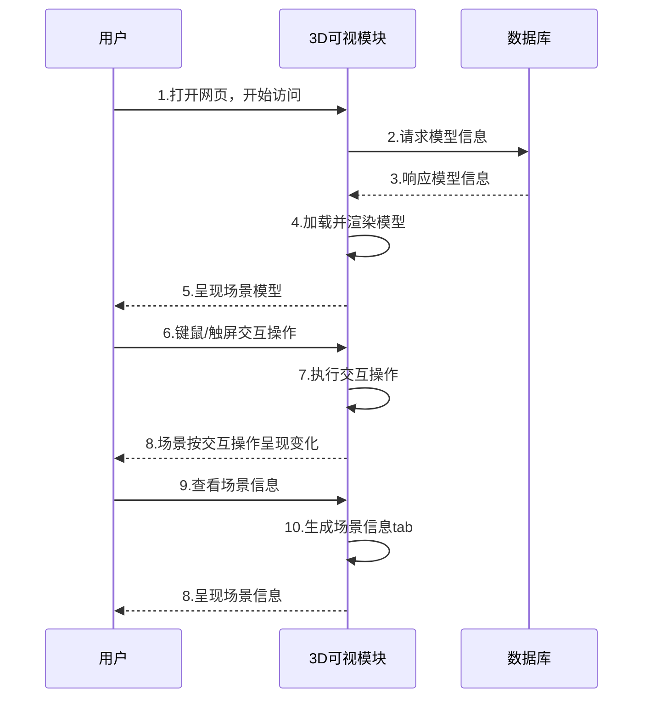
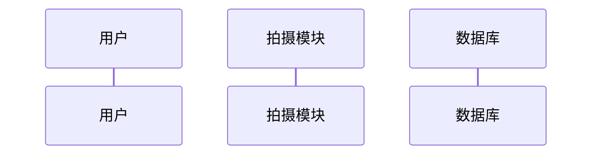
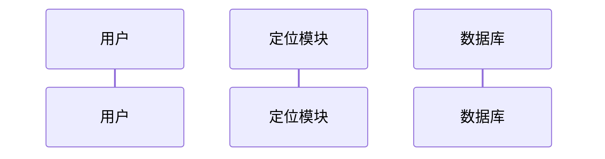
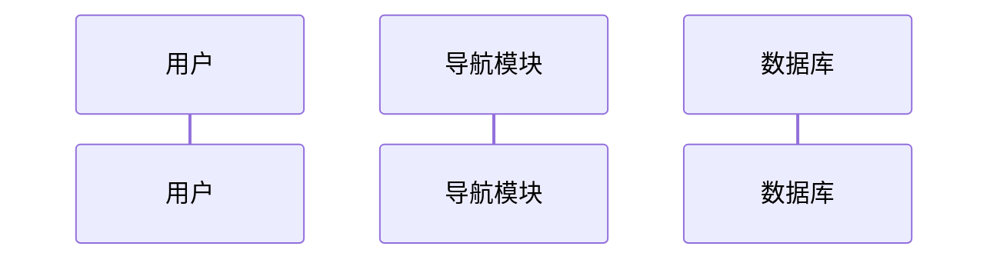

# 需求和功能

>**需求分析**：
    3D场景视角切换、场景信息显示、摄像头获取、室内定位、*室内导航*(待定)

|用例名称|场景|用例描述|
|:---|:---|:---|
|视角切换|who：用户，系统；  where：加载了模型的页面；  when：用户访问页面时|1.用户进入系统;  2.系统将3D场景呈现给用户；  3.用户通过触屏/键鼠的方式向系统发出视角切换请求；  4.系统接收请求，呈现给用户想浏览的视角；  5.视角切换完成|
|信息显示|who：用户，系统；  where：加载了模型的页面；  when：用户访问页面时|1.用户通过触屏/键鼠的方式向系统发出获取场景详细信息的请求；  1.1 系统中没有该场景详细信息，系统做出提示；  2.系统接收请求，呈现给用户想浏览的信息；  3.信息显示完成|
|摄像头获取|who：用户，系统；  where：处理图片的页面；  when：用户点击功能按钮时|1.用户通过触屏/键鼠的方式向系统发出室内使用摄像头请求；  2.系统接收请求，弹出摄像头；  3.用户摁下快门获取某处场景照片|
|室内定位|who：用户，系统；  where：加载了模型的页面；  when：用户点击功能按钮时|1.用户拍摄一张图片作为定位依据；  1-A 用户使用本地图片作为定位依据；  2.用户通过触屏/键鼠的方式向系统发出室内定位请求；  3.系统根据照片识别出用户所处场景的位置，并将位置以热点的形式呈现在3D模型上；  3.室内定位完成|
|室内导航(待定)|who：用户，系统；  where：加载了模型的页面；  when：用户点击功能按钮时|1.用户通过触屏/键鼠的方式向系统发出室内导航请求；  1-A 用户使用搜索框输入目的地名称；  1-A.1 目的地名称不在场景信息中，导航失败；  1-A.1目的地名称在场景信息中，进行导航；  2.系统根据用户位置和目的地位置进行路线规划，并将路线规划以线路的形式呈现在3D模型上；  3.室内导航完成|

>**功能分析**：
    3D可视模块：3D模型加载与呈现、键鼠/触屏交互控制、场景信息展示
    拍摄模块：摄像头权限获取、本地相册权限获取
    定位模块：图片特征化、特征值比对、定位可视化
    *导航模块*(待定)：目的地确定、最优路线推荐、路线可视化

|功能编号|功能描述|涉及用例|
|--|--|--|
|001|3D模型加载与呈现|视角切换、信息显示、室内定位、室内导航|
|002|键鼠/触屏交互控制|所有|
|003|场景信息展示|信息展示、室内导航|
|004|获取摄像头权限|摄像头获取|
|005|获取本地相册权限|摄像头获取|
|006|图片特征化|室内定位|
|007|特征值比对|室内定位|
|008|模型上添加热点|室内定位|
|009|目的地确定|室内导航|
|010|最优路径推荐|室内导航|
|011|模型上添加路线|室内导航|

# 时序图
### 用户-3D可视模块

### 用户-拍摄模块

### 用户-定位模块

### 用户-导航模块
